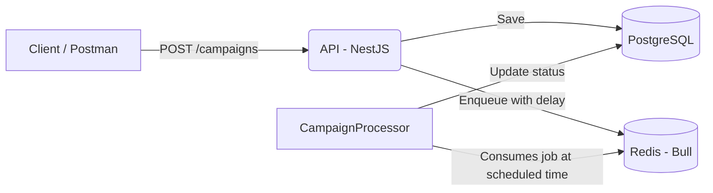

# Mini WhatsApp Campaign Scheduler API

A minimal NestJS backend to schedule messaging campaigns. Campaign data is stored in PostgreSQL via TypeORM. Jobs are scheduled and processed with Bull (Redis). A queue processor simulates sending messages at the scheduled time.

## Tech Stack

- **Framework:** NestJS (TypeScript)
- **Database:** PostgreSQL
- **ORM:** TypeORM
- **Queueing:** Bull.js with Redis (`@nestjs/bull`)
- **Containerization:** Docker + Docker Compose
- **Docs:** Swagger (OpenAPI) at `/api`

## Architecture

- **API (NestJS):** Exposes endpoints to create and fetch campaigns.
- **DB (PostgreSQL):** Stores `Campaign` and `Contact` entities.
- **Redis (Bull):** Schedules jobs for campaign processing.
- **Worker (Processor):** `CampaignProcessor` consumes queued jobs and simulates sending.



## Entities

- **Campaign**
  - `id` (UUID, PK)
  - `message_body` (text)
  - `scheduled_at` (timestamptz)
  - `status` ('PENDING' | 'PROCESSING' | 'COMPLETE')
  - `created_at`, `updated_at`
- **Contact** (future use)
  - `id` (UUID, PK)
  - `name` (string)
  - `phone_number` (string, unique)

## How to Run

1. Ensure Docker and Docker Compose are installed.
2. From the project root, run:

```bash
docker-compose up --build
```

3. After containers start:
   - API: http://localhost:3000
   - Swagger docs: http://localhost:3000/api
   - PostgreSQL: localhost:5432 (db: `whatsapp_campaigns`, user: `postgres`, password: `postgres`)
   - Redis: localhost:6379

## API Endpoints

- `POST /campaigns`
  - Body: `{ "message_body": string, "scheduled_at": date-string }`
  - Creates a campaign (status `PENDING`), enqueues a delayed job.
- `GET /campaigns/:id`
  - Returns a single campaign by id.

## Notes

- TypeORM `synchronize: true` for convenience in this demo; disable in production.
- The queue processor (`src/campaigns/CampaignProcessor.ts`) runs within the API service and simulates work with a 5-second delay.
