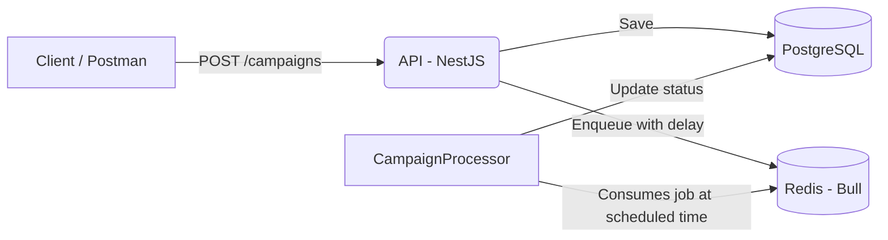

# Mini WhatsApp Campaign Scheduler API

A minimal NestJS backend to schedule messaging campaigns. Campaign data is stored in PostgreSQL via TypeORM. Jobs are scheduled and processed with Bull (Redis). A queue processor simulates sending messages at the scheduled time.

## Tech Stack

- **Framework:** NestJS (TypeScript)
- **Database:** PostgreSQL
- **ORM:** TypeORM
- **Queueing:** Bull.js with Redis (`@nestjs/bull`)
- **Containerization:** Docker + Docker Compose
- **Docs:** Swagger (OpenAPI) at `/api`

## Architecture

- **API (NestJS):** Exposes endpoints to create and fetch campaigns.
- **DB (PostgreSQL):** Stores `Campaign` and `Contact` entities.
- **Redis (Bull):** Schedules jobs for campaign processing.
- **Worker (Processor):** `CampaignProcessor` consumes queued jobs and simulates sending.



---
## ## Getting Started

These instructions will get you a copy of the project up and running on your local machine for development and testing purposes.

### ### Prerequisites

* [Git](https://git-scm.com/)
* [Docker](https://www.docker.com/products/docker-desktop) and [Docker Compose](https://docs.docker.com/compose/)

### ### Installation

1.  **Clone the repository:**
    ```sh
    git clone [https://github.com/your-username/your-repo-name.git](https://github.com/your-username/your-repo-name.git)
    cd your-repo-name
    ```

2.  **Run the application:**
    This single command will build the images, start the containers, and run the application.
    ```sh
    docker-compose up --build
    ```
    To run in the background, use the `-d` flag: `docker-compose up --build -d`

The API will be available at `http://localhost:3000`.

---
## ## API Usage

### ### Interactive API (Swagger)

For easy testing and exploration, this project includes auto-generated interactive API documentation. Once the application is running, navigate to:

**`http://localhost:3000/api`**

### ### `curl` Examples

#### #### 1. Schedule a New Campaign

* **Request:**
    ```sh
    curl --location 'http://localhost:3000/campaigns' \
    --header 'Content-Type: application/json' \
    --data '{
        "message_body": "Hello! This is a test campaign message.",
        "scheduled_at": "2025-10-04T12:00:00.000Z"
    }'
    ```

* **Success Response (201 Created):**
    ```json
    {
        "message_body": "Hello! This is a test campaign message.",
        "scheduled_at": "2025-10-04T12:00:00.000Z",
        "id": "a1b2c3d4-e5f6-g7h8-i9j0-k1l2m3n4o5p6",
        "status": "PENDING",
        "created_at": "2025-10-04T01:30:00.123Z",
        "updated_at": "2025-10-04T01:30:00.123Z"
    }
    ```

#### #### 2. Check Campaign Status

* **Request:**
    Replace `{id}` with the ID you received from the previous request.
    ```sh
    curl --location 'http://localhost:3000/campaigns/a1b2c3d4-e5f6-g7h8-i9j0-k1l2m3n4o5p6'
    ```

* **Success Response (200 OK):**
    The `status` will update from `PENDING` to `PROCESSING` and finally `COMPLETE` as the worker processes the job.
    ```json
    {
        "id": "a1b2c3d4-e5f6-g7h8-i9j0-k1l2m3n4o5p6",
        "message_body": "Hello! This is a test campaign message.",
        "scheduled_at": "2025-10-04T12:00:00.000Z",
        "status": "COMPLETE",
        "created_at": "2025-10-04T01:30:00.123Z",
        "updated_at": "2025-10-04T01:31:05.456Z"
    }
    ```

---
## ## Future Improvements

* **Real-time Status Updates**: Implement WebSockets to push live campaign status updates to a client.
* **Contact Management**: Build out full CRUD endpoints for the `Contact` entity.
* **Authentication & Authorization**: Secure the API endpoints using JWT and role-based access control.
* **Enhanced Job Processing**: Add retry logic and error handling for failed jobs in the queue.
* **Analytics**: Create an endpoint to provide simple analytics on completed campaigns.


## Entities

- **Campaign**
  - `id` (UUID, PK)
  - `message_body` (text)
  - `scheduled_at` (timestamptz)
  - `status` ('PENDING' | 'PROCESSING' | 'COMPLETE')
  - `created_at`, `updated_at`
- **Contact** (future use)
  - `id` (UUID, PK)
  - `name` (string)
  - `phone_number` (string, unique)

## Notes

- TypeORM `synchronize: true` for convenience in this demo; disable in production.
- The queue processor (`src/campaigns/CampaignProcessor.ts`) runs within the API service and simulates work with a 5-second delay.
